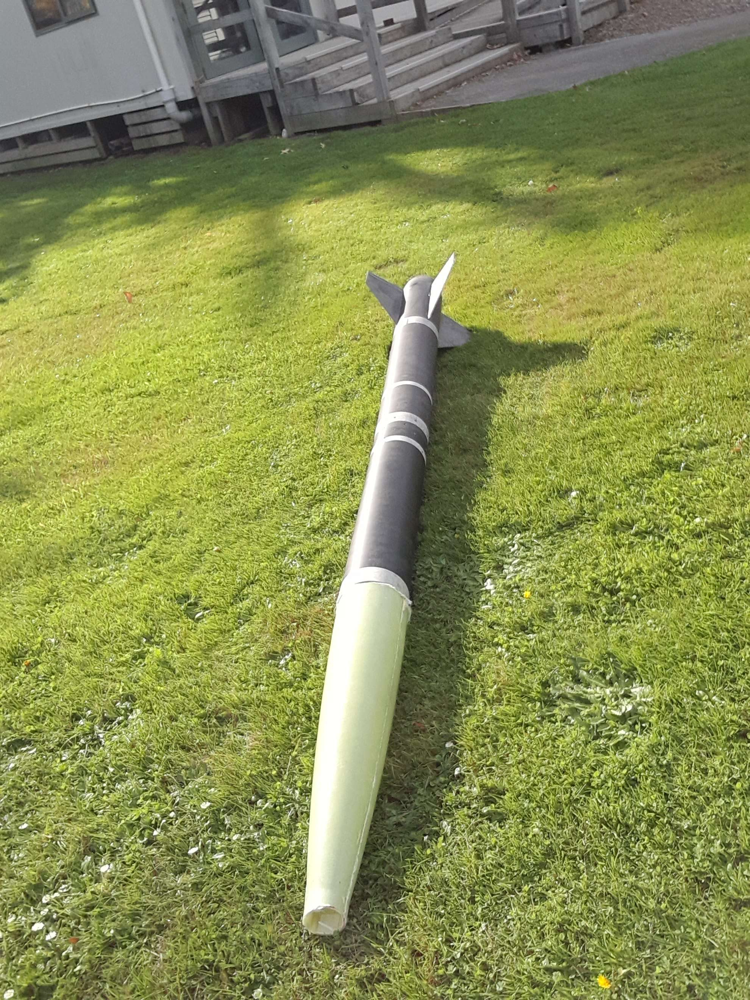
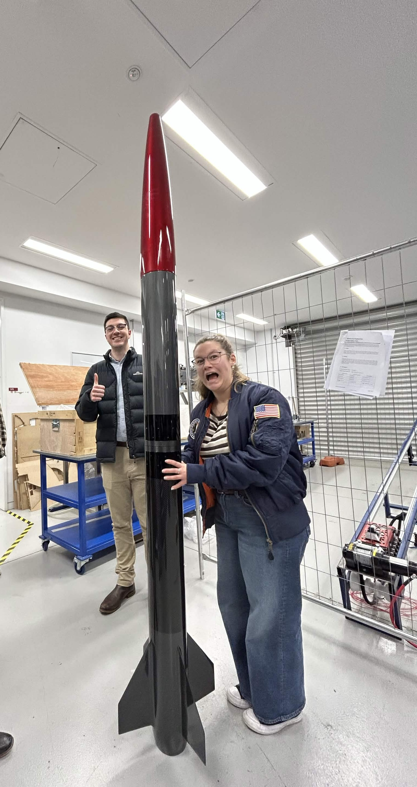
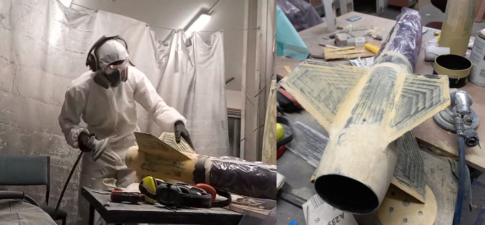

# Australian Universities Rocketry Competition (Kōtare)

I've worked on the AURC Competition rocket as part of the UC Aerospace Club outside of my coursework! My role was supporting the avionics team lead by designing the Featherweight and COTS battery holders for the fibreglass PCB sled. I also created various fibreglass and carbon-fibre composites as part of the manufacturing process and was involved in integrating two subsystems (the airbrakes into the payload and booster tubes) through the use of 3D-printed jigs designed in SolidWorks.

Future iterations of the rocket will represent UC for the AURC 27 competition as well! Building upon this experience and improving previous designs will be an important factor down the road. I will also become a team lead for avionics during this time as well!

**NB:** This is a UC Aerospace project intended for the AURC 26 competition at White Cliffs, NSW.

  
    
  <i>Figure 1: Petal-style 3D-printed and CNC Machined Airbrakes </i>

  
    
  <i>Figure 2: Complete Assembly of Rocket </i>

    
  <i>Figure 3: Pneumatic Sanding of the Bogged Rocket (Click for video!) </i>

