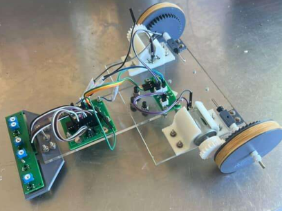
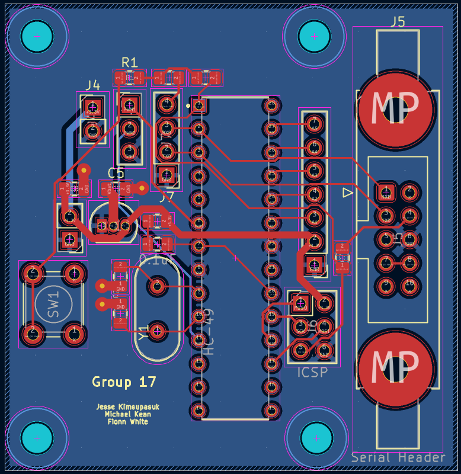
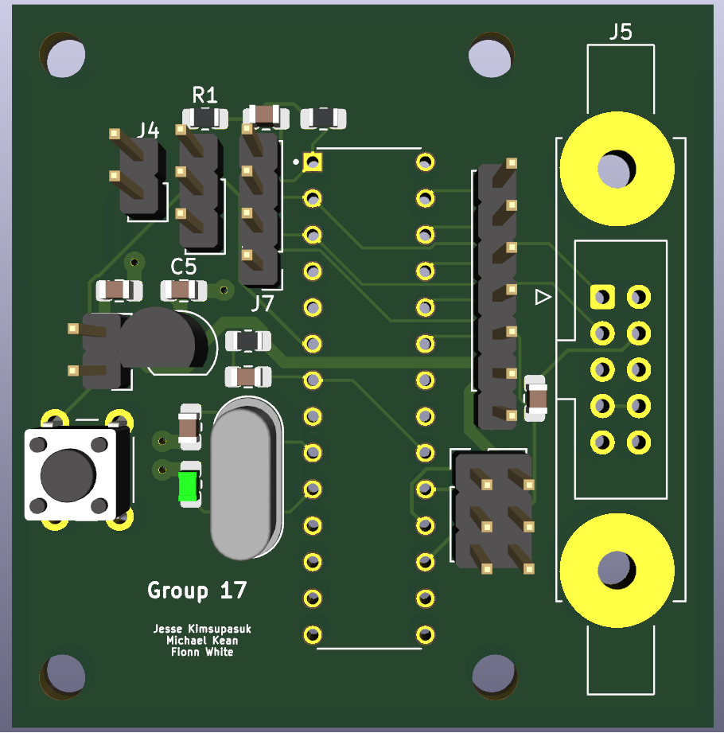

# Line-Following Robot

This was a group project of three during the course of my degree. The project taught me more about **testing**, **validating hardware**, and **PCB design** than I would have thought! Working in a team to communicate effectively and meet design requirements was also an important factor in the outcome for this project.

My role was the three PCB's along with the wheel assembly for the robot. C++ was used to code the robot which I designed to allow the hardware and software to work together. My group members worked on the robot chassis along with integrating the sensor array into the robot!

   
  <i>Figure 1: Assembly of Robot Build</i>

  
    
  <i>Figure 2: Microprocessor PCB Layout </i>

  
    
  <i>Figure 3: Motor Driver PCB Layout </i>

  
    
  <i>Figure 4: Sensor Array PCB Layout </i>

## Note:
The microprocessor PCB had several issues identified during testing. A labelling error in the PCB design caused the battery voltage and regulated voltage to be swapped, resulting in the entire board receiving the battery voltage of +5.2 V instead of the regulated +3.3 V supply. This issue was resolved by placing the voltage regulator externally and connecting it via wires to the correct locations on the PCB.

The power input to the microprocessor had also been routed through an unnecessary capacitor and resistor (R3 and C6 on the schematic). To solve this, the capacitor and resistor were omitted during assembly, and a wire was soldered to bypass the circuit, connecting the voltage regulator output directly to the microprocessor input.

Finally, the microprocessor pin originally selected for the PWM1 signal, PD4, was not capable of pulse-width modulation output. To resolve this, a wire was connected between the PWM1 connector and PD3 (pin 5 on the board), and the software was updated to output the PWM1 signal on the new pin.

After resolving these issues and connecting the individual PCBs using connector wires, the circuit was able to read the line position through the sensors and control the speed of each motor independently using pulse-width modulation.
