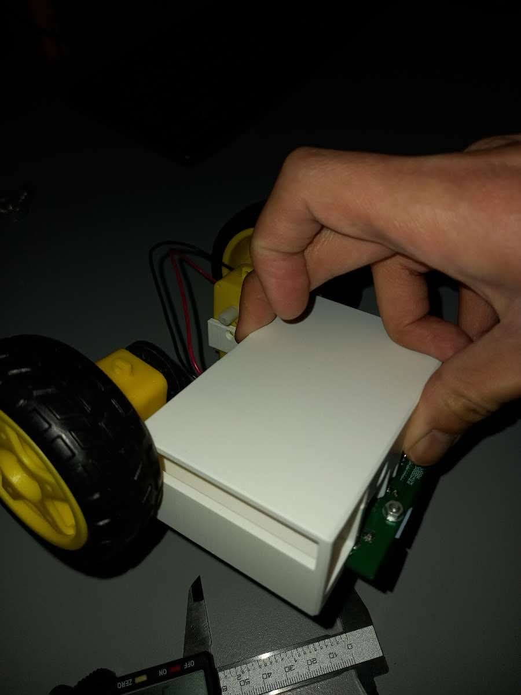
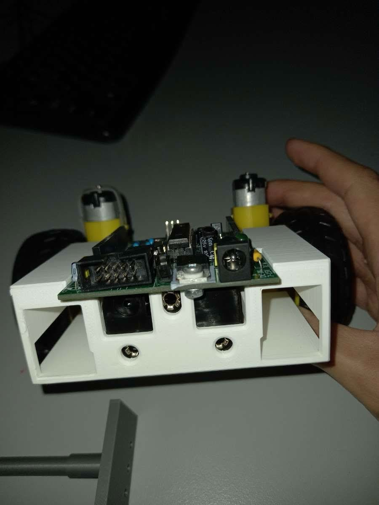
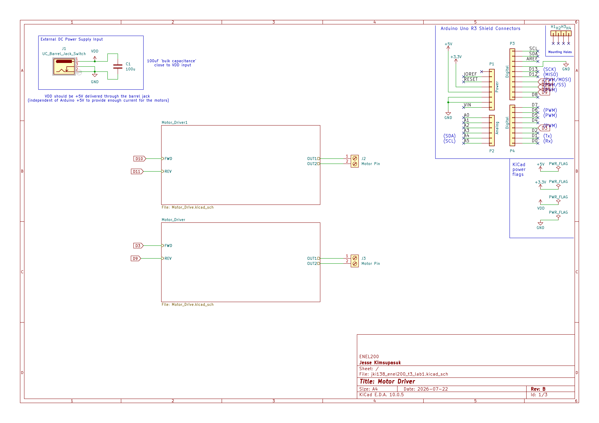
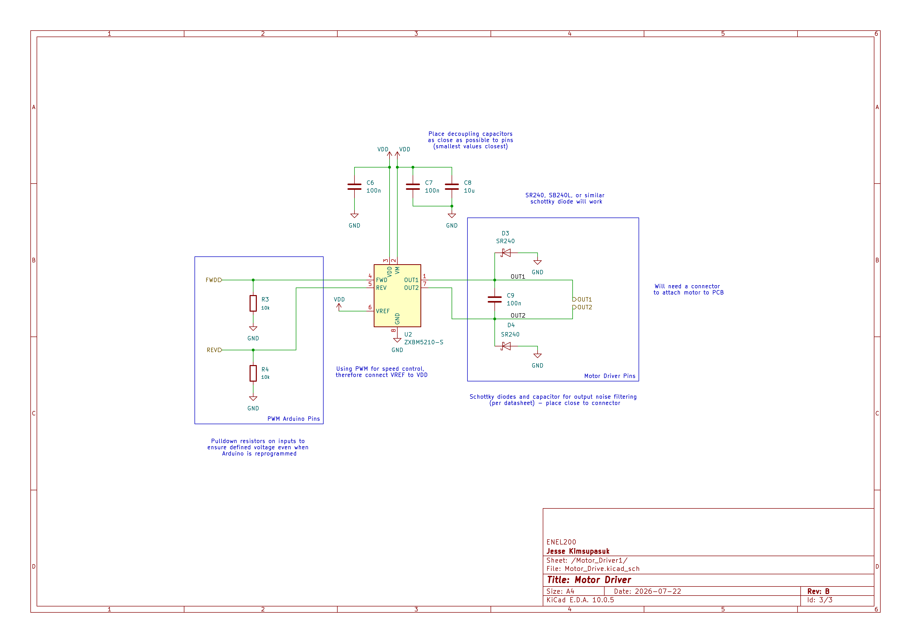
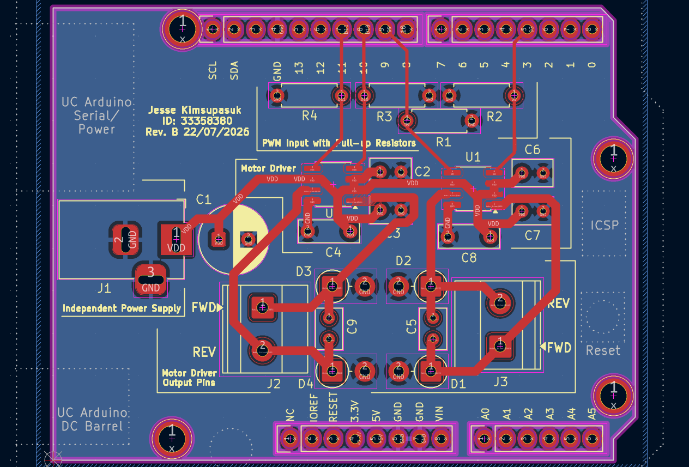
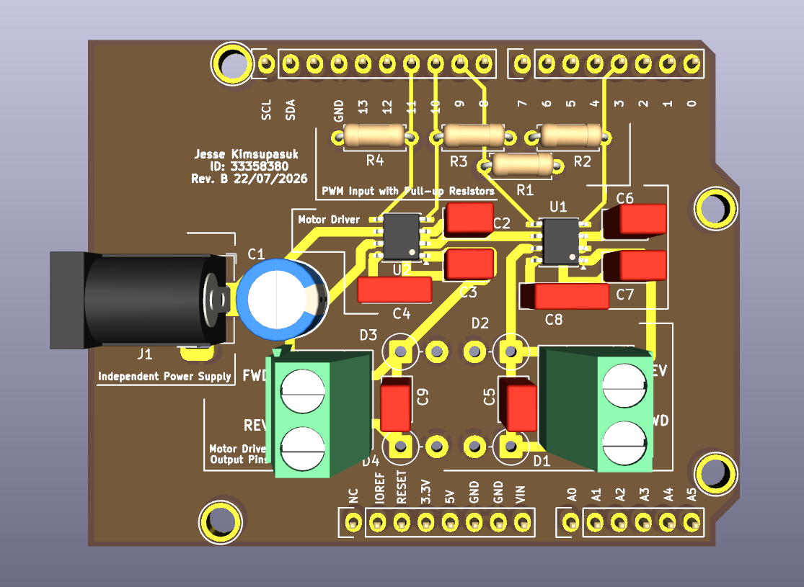

# Arduino Turtle Robot

An independent project where I am challenged to create a robot assembly without using fasteners! This boosted my **SolidWorks** skills by minimising the amount of PLA needed by using creative thinking. Later in the year, a completely working version will be shown here in untethered form.

* **PCB Layout** using ZXBM5210-S Motor Drivers for a UC Arduino UNO.
* **Schematic** includes implementation of an external DC power supply, bypass capacitors, pull-up resistors and various connectors.

  
    
  <i>Figure 1: First iteration assembly of Arduino Turtle Robot </i>

  
    
  <i>Figure 2: Main and Hierarchal Schematic of Robot </i>

  
    
  <i>Figure 3: PCB Layout of Robot </i>

